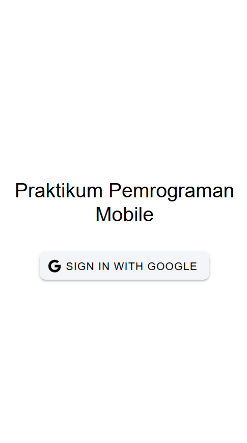
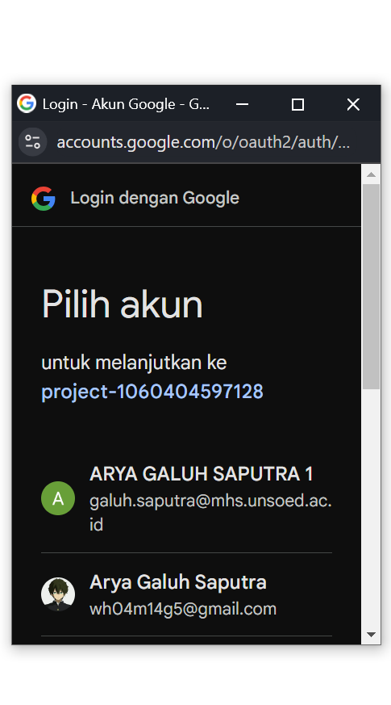
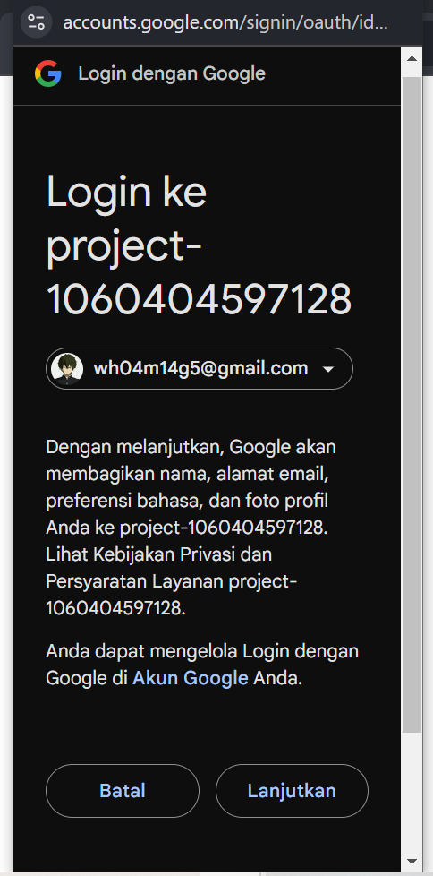
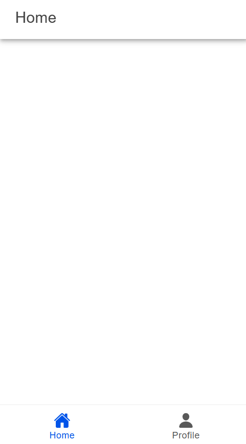
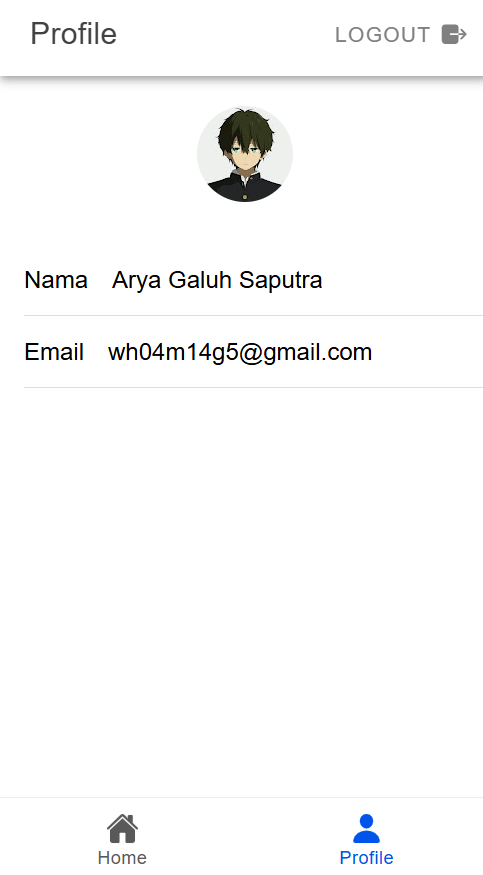

# Tugas 9 - Pertemuan 10

- **Nama** : Arya Galuh Saputra
- **NIM** : H1D022022
- **Shift Lama** : C
- **Shift Baru** : B

## Screenshot & Penjelasan

### 1. Login Page



Tampilan halaman login aplikasi yang menyediakan tombol "Sign In with Google" untuk memulai autentikasi.

### 2. Proses Login Google



Munculnya popup pilihan akun Google saat pengguna menekan tombol login.



Persetujuan izin akses yang diminta oleh aplikasi dari akun Google pengguna.

### 3. Home Page



Tampilan halaman utama aplikasi setelah login berhasil, berisi navigasi dan konten utama.

### 4. Profile Page



Halaman profil yang memuat informasi pengguna dari akun Google, seperti nama, email, dan foto profil.

## Alur Kerja Autentikasi

1. **Inisialisasi Firebase dan Google Auth**
   - Aplikasi dimulai dengan mengonfigurasi Firebase menggunakan kredensial dari Firebase Console.
   - Menyiapkan penyedia Google Auth dengan Client ID yang diperoleh dari Google Cloud Console.

   ```typescript
   const firebaseConfig = {
   apiKey: "YOUR_API_KEY",
   authDomain: "YOUR_AUTH_DOMAIN",
   projectId: "YOUR_PROJECT_ID",
   // ...other config
   };

   const firebase = initializeApp(firebaseConfig);
   const auth = getAuth(firebase);
   ```

2. **Proses Login**
   - Pengguna menekan tombol "Sign In with Google".
   - Aplikasi menginisialisasi Google Auth dengan Client ID yang telah diatur sebelumnya.
   - Muncul popup untuk memilih akun Google.
   - Pengguna memilih akun dan memberikan izin akses yang diperlukan.
   - Aplikasi menerima token autentikasi dari Google.
   - Token tersebut diverifikasi oleh Firebase.
   - Data pengguna disimpan dalam Firebase Authentication.

   ```typescript
   const loginWithGoogle = async () => {
   try {
      await GoogleAuth.initialize({
         clientId: "YOUR_CLIENT_ID",
         scopes: ["profile", "email"],
         grantOfflineAccess: true,
      });
      const googleUser = await GoogleAuth.signIn();
      const credential = GoogleAuthProvider.credential(
         googleUser.authentication.idToken
      );
      await signInWithCredential(auth, credential);
      router.push("/home");
   } catch (error) {
      console.error("Google sign-in error:", error);
      // Handle error
   }
   };
   ```

3. **Pengelolaan State dan Data Pengguna**
   - Data pengguna dikelola menggunakan Pinia store.
   - Informasi seperti foto profil, nama, dan email diambil dari data akun Google.
   - Status autentikasi dipantau menggunakan `onAuthStateChanged`.
   - Router guard digunakan untuk melindungi halaman yang memerlukan autentikasi.

4. **Implementasi Teknis**
   - Memanfaatkan `@codetrix-studio/capacitor-google-auth` untuk menangani proses Google Sign-In.
   - Melakukan error handling untuk menangani kasus kegagalan login.
   - Menyiapkan router navigation guard untuk melindungi route.
   - Mengimplementasikan fungsi logout untuk membersihkan state dan mengarahkan kembali ke halaman login.